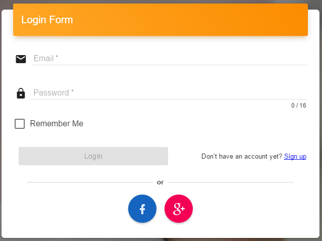

[](https://ci.appveyor.com/project/tugrulelmas/abiokaapi) [](https://travis-ci.org/tugrulelmas/AbiokaApi)

# AbiokaApi

This is a boilerplate framework helps you build fast, robust, and modern web application. S.O.L.I.D principles are applied in this project. It implements NLayer Architecture (Domain, Application, Infrastructure and UI Layers) and also provides a good infrastructure to implement best practices such as Aspect Oriented Programming, Dependency Injection.

* [Installation](#installation)
* [License](#license)
* [Demo](#demo)

##Covered Functionality##
- [Authentication](#authentication)
- [Authorization](#authorization)
- [OAuth 2](#oauth-2)
- [Validation](#validation)
- [Localization](#localization)
- Inversion of Control
- CRUD Operations
- Repository Pattern
- RESTful Services
- [Single Page Application](#single-page-application)
- [Aspect Oriented Programming](#aspect-oriented-programming)
- Object Oriented Programming

##Used Technologies##
- [Asp.Net Web Api 2](https://www.asp.net/web-api)
- [SQL Server](https://www.microsoft.com/en-us/sql-server)
- [FluentValidation](https://github.com/JeremySkinner/FluentValidation)
- [Castle Windsor](https://github.com/castleproject/Windsor)
- [NHibernate](http://nhibernate.info)
- [Fluent NHibernate](https://github.com/jagregory/fluent-nhibernate)
- [AngularJS](https://angularjs.org)
- [Angular Material](https://material.angularjs.org)
- [Material Design Data Table](https://github.com/daniel-nagy/md-data-table)
- [Gulp](http://gulpjs.com)
- [npm](https://www.npmjs.com)
- [NUnit](https://www.nunit.org)
- [Moq](https://github.com/moq/moq4)
- [Unsplash](https://unsplash.com)

##Aspect Oriented Programming##
There are dynamic handlers and service interceptors for adding additional behavior to the RESTful or Application Service layer without modifying service codes.

#### 1. Dynamic Handler
It aims to add behavior for RESTful Service (AbiokaApi.Host application). These behaviors can be logging Http Request and Response messages, checking authentication etc. If you want to do something for every request or response, you should use a dynamic handler. 

##### Usage
Write a class that implements IDynamicHandler interface.
```csharp
public class NhUnitOfWorkHandler : IDynamicHandler
{
    private readonly IUnitOfWork unitOfWork;

    public short Order => 10;

    public NhUnitOfWorkHandler(IUnitOfWork unitOfWork) {
        this.unitOfWork = unitOfWork;
    }

    public void BeforeSend(IRequestContext requestContext) {
        if (!unitOfWork.IsInTransaction)
        {
            unitOfWork.BeginTransaction();
        }
    }

    public void AfterSend(IResponseContext responseContext) {
        if (unitOfWork.IsInTransaction)
        {
            unitOfWork.Commit();
        }
    }

    public void OnException(IExceptionContext exceptionContext) {
        if (unitOfWork.IsInTransaction)
        {
            unitOfWork.Rollback();
        }
    }
}
```
Register this class with IoC container. To learn additional information about Lifestyles please read [this](https://github.com/castleproject/Windsor/blob/master/docs/lifestyles.md).
```csharp
 DependencyContainer.Container.Register<IDynamicHandler, NhUnitOfWorkHandler>(LifeStyle.PerWebRequest)
```
There are following dynamic handlers:

##### 1.1. AuthenticationHandler
It checks Http Request header to find Json Web Token and throws an exception, if there is no valid token and the action is not allowed for anonymous login.

##### 1.2. ExceptionHandler
It catches every exception and wraps it and then returns Http Response with specific Status Code and additional Header value.

##### 1.2. NhUnitOfWorkHandler
It opens a db transaction before calling service layer and commits this transaction after service layer response. If there is an exception, it rollbacks the transaction.

#### 2. Service Interceptors
It aims to add behavior for the application services (AbiokaApi.ApplicationService application).

##### 2.1 RoleValidationInterceptor
if the current user hasn't the role which is necessary for the application service method, it throws an exception. 

```csharp
internal class RoleValidationInterceptor : IServiceInterceptor
{
    private readonly ICurrentContext currentContext;

    public RoleValidationInterceptor(ICurrentContext currentContext) {
        this.currentContext = currentContext;
    }

    public int Order => 0;

    public void BeforeProceed(IInvocationContext context) {
        var attributes = context.Method.GetCustomAttributes(typeof(AllowedRole), true);
        if (attributes == null || attributes.Count() == 0)
            return;

        if(currentContext.Current.Principal.Roles == null)
            throw new DenialException("AccessDenied");


        var allowedRoles = (AllowedRole)attributes.First();
        if (currentContext.Current.Principal.Roles.Any(r => allowedRoles.Roles.Contains(r)))
            return;

        throw new DenialException("AccessDenied");
    }
}
```

## Validation
Creating a class that inherits CustomValidator<`parameter type`> is enough to validate the parameter type for every service method which has this parameter.

**Example**

```csharp
public interface IUserService : IReadService<User>
{
    User Add(AddUserRequest request);
}
```

```csharp
public class AddUserRequestValidator : CustomValidator<AddUserRequest>
{
    private readonly IUserSecurityRepository userSecurityRepository;

    public AddUserRequestValidator(IUserSecurityRepository userSecurityRepository) {
        this.userSecurityRepository = userSecurityRepository;

        RuleFor(r => r.Email).NotEmpty().WithMessage("IsRequired").EmailAddress().WithMessage("ShouldBeCorrectEmail");
        RuleFor(r => r.Password).NotEmpty().WithMessage("IsRequired");
    }

    protected override void DataValidate(AddUserRequest instance, ActionType actionType) {
        var tmpUser = userSecurityRepository.GetByEmail(instance.Email);
        if (tmpUser != null)
            throw new DenialException("UserIsAlreadyRegistered", instance.Email);
    }
}
```

## Authentication

[JWT](http://jwt.io) is used for Authentication. Once the user is logged in, then JWT is generated and returned as a response. Each subsequent request will include the JWT, allowing the user to access routes, services, and resources that are permitted with that token. You may want to look at [AuthenticationHandler](#11-authenticationhandler) 

**Allow Anonymous**

Adding `AllowAnonymous` attributte to a controller method disables token validation for that method.

```csharp
[RoutePrefix("api/User")]
public class UserController : BaseReadController<User>
{
    private readonly IUserService userService;

    public UserController(IUserService userService)
        : base(userService) {
        this.userService = userService;
    }

    [AllowAnonymous]
    [HttpPost]
    [Route("Login")]
    public HttpResponseMessage Login([FromBody]LoginRequest request) {
        var token = userService.Login(request);

        var response = Request.CreateResponse(HttpStatusCode.OK, token);
        return response;
    }
}
```
## OAuth 2

Facebook and Google accounts can also used for login.



## Authorization

Only defining the roles with `AllowedRole` attributte for service method is sufficient for authorization. You may want to look at [RoleValidationInterceptor](#21-rolevalidationinterceptor)

**Example**
```csharp
public interface IUserService : IReadService<User>
{
     [AllowedRole("Admin", "SuperUser")]
     void Update(User entiy);
}
```
## Single Page Application

AngularJS provides SPA template for UI.

#### abioka-data-table

It's a compenent wraps [md-data-table](https://github.com/daniel-nagy/md-data-table). It uses [$resource](https://docs.angularjs.org/api/ngResource/service/$resource) object to interact with RESTful server-side data sources. 

**Example**

With load-data option:
```html
<abioka-data-table options="vm.options" load-data="vm.loadData">
</abioka-data-table>
```
```javascript
 /* @ngInject */
 function UsersController($timeout, AdminResource) {
     var vm = this;
     vm.loadData = false;
     vm.options = {
         loadOnInit: false, // If you want to load data immediately, pass this as true.
         rowSelection: false,
         resource: AdminResource.users,
         query: {},
         columns: [{ name: "Email", text: "Email", order: true }],
         dialogController: 'UserDialogController',
         editTemplate: '/app/components/user/userDialog.html',
         deleteTemplate: '/app/shared/deleteComponent/deleteComponent.html'
     };

     $timeout(function () {
         vm.loadData = true;
     }, 1000);
 }
```

With cellTemplate option:
```html
<abioka-data-table options="vm.options">
</abioka-data-table>
```
```javascript
/* @ngInject */
function LoginAttemptsController($filter, AdminResource) {
    var vm = this;

    var resultTemplate = "<span class='ab-label' ng-class=\"{'label-warning': entity.LoginResult === 'WrongPassword', 'label-success': entity.LoginResult === 'Successful'}\">{{entity.LoginResult | translate}}</span>";
    var fulldateFormat = $filter("translate")("FullDateFormat");
    var dateTemplate = "<span>{{entity.Date | abDate:'" + fulldateFormat + "'}}</span>";

    vm.options = {
        loadOnInit: true,
        rowSelection: false,
        isReadOnly: true,
        resource: AdminResource.loginAttempts,
        query: { order: '-Date' }, // default order by Date descending while loading data.
        columns: [{ name: "Date", text: "Date", order: true, cellTemplate: dateTemplate },
            { name: "User.Email", text: "Email" },
        { name: "LoginResult", text: "LoginResult", cellTemplate: resultTemplate },
        { name: "IP", text: "IP" }],
    };
}
```

### Localization

Language resources are stored under [resources](AbiokaApi.Host/src/app/resources) folder and used with `translate` filter.

**Example**

resource_en.json:
```json
{
  "Password": "Password",
  "PasswordAgain": "Password Again",
  "IsAdmin": "Is Admin",
  "LoginForm": "Login Form",
}
```

in html:
```html
<label>{{'Password' | translate}}</label>
```

## Demo

You can test this application at [demo.abioka.com](http://demo.abioka.com)

```
User Name: demo@abioka.com
Password : demo
```

[](http://www.youtube.com/watch?v=UZl7nWQIbtw)

## Installation

Clone this repository to your local machine.

```
git clone https://github.com/tugrulelmas/AbiokaApi.git
```

Run the following codes:
```
cd AbiokaApi/AbiokaApi.Host
npm install
gulp
```

Change connection string in [web.config](AbiokaApi.Host/Web.config)

Change Facebook and Google's client and secret key's value in [web.config](AbiokaApi.Host/Web.config)

Open the [AbiokaApi.sln](AbiokaApi.sln) with Visual Studio and then run the project.

## License
This project is licensed under the MIT License - see the [LICENSE](LICENSE) file for details
